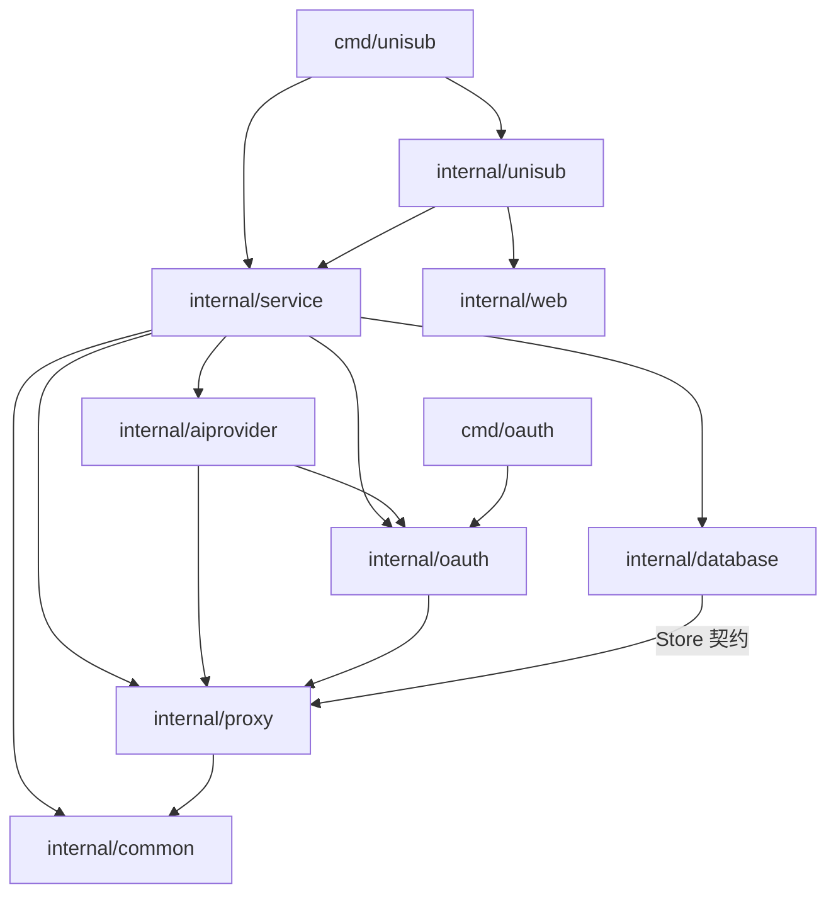

# 系统结构

本文描述 Go 包、Service 框架和 UniSub 应用模块之间的关系。按当前实现的依赖与职责边界组织结构。各包的接口细节由对应文档维护。

## 包与应用模块

**包是代码依赖边界，应用模块是 HTTP 职责与生命周期边界，两者不是一一对应。**

- `internal/common`、`database`、`proxy`、`oauth`、`aiprovider` 提供基础或领域能力，不注册 UniSub 的业务路由。
- `internal/service` 定义 Module、ModuleContext、路由、认证和共享依赖的管理方式，不导入具体 UniSub 应用模块。
- `internal/unisub` 组装应用，在同一个 Go 包内实现 static、api、oauthflow、gateway 四个模块；它们不是四个独立 Go 包。
- `cmd/unisub` 是进程入口，负责配置与 HTTP 监听；`internal/web` 提供构建资源，不是业务模块。
- 认证是 Service 提供的共享能力，不单独增加 UniSub auth 模块或认证文档。

## 分层与包依赖

下图表示主要代码依赖方向，箭头从使用方指向被依赖方，不表示请求流向，也不枚举每一条工具函数依赖。



应用层可以使用上下文返回的领域类型完成数据转换，但底层包不因此反向依赖应用。数据库对 Proxy 的依赖用于实现其 Store 契约；Proxy 不导入 Database。OAuth 的 CredentialStore 由接口结构匹配注入，不要求 OAuth 导入具体数据库包。

| 包 | 职责 | 关键边界 | 文档 |
| --- | --- | --- | --- |
| common | 公共错误消息、JSON 错误输出与统一日志 | 不承担代理职责，不包含 proxy.go | [Common](common.md) |
| database | 统一数据库接口、SQLite 持久化与内部缓存 | MemoryDatabase 是内部缓存数据结构，不是并列数据库后端 | [Database](database.md) |
| proxy | 代理对象、内部 URL 校验、HTTP 传输、代理组、调度与统计 | 不依赖 OAuth、AIProvider、Service 或应用；通过自身 Store 接口使用持久化 | [Proxy](proxy.md) |
| oauth | 授权协议、Session、Credential、刷新与撤销 | 显式依赖 Proxy，不感知应用路由、用户角色、页面或具体数据库 | [OAuth](oauth.md) |
| aiprovider | 上游配置、工厂、实例、Account 和调用转发 | 使用 OAuth 与代理能力，不依赖数据库；记录由调用方接收 | [AIProvider](ai-provider.md) |
| service | 模块机制、路由、AuthService、共享 Manager 和结果存储 | 持有共享依赖，不导入 UniSub；auth.go 的实现契约归本层 | [Service](service.md) |
| unisub | 应用初始化、四个业务模块、HTTP 参数与业务授权 | 通过 ModuleContext 使用共享能力，负责业务实体转换 | [UniSub](unisub.md) |
| web | 前端构建资源的嵌入与 fs.FS 访问 | 不承担认证、路由或业务逻辑 | [Static](unisub-static.md) |

## UniSub 模块与共享能力

四个模块实现 `service.Module` 的 Name、Init、Close。应用选择并注册模块；Service 保存 Module 接口，调用初始化与关闭方法，运行时无需导入具体应用类型。

```text
unisub.New
  ├─ 创建 Service 及共享依赖
  ├─ 确保初始管理员、恢复持久化账号
  └─ AddModule
       ├─ StaticModule
       ├─ APIModule
       ├─ OAuthFlowModule
       └─ GatewayModule
            │
            └─ Init(ModuleContext)：注册路由、取得所需共享能力

Service.Handler：匹配路由 → 按 AuthMode 认证 → 调用模块 Handler
Service.Close：逆序关闭已注册模块 → 关闭数据库
```

以下职责由对应应用模块实现。

| 模块 | HTTP 职责 | 使用的共享能力 | 不负责 |
| --- | --- | --- | --- |
| static | `/` 返回同一静态网页，提供公共资源 | 注入的 fs.FS、路由注册 | 不查询 Session，不登录／登出，不按身份重定向 |
| api | `/api/login`、`/api/logout` 与普通管理接口 | AuthService、Database、AIProviderManager、Proxy Manager | 不执行 OAuth 协议，不转发 AI 请求 |
| oauthflow | `/api/oauth/*` 与公开回调 | Principal、OAuthManager、OAuthResultStore、代理对象 | 不在回调中创建业务账号，不把页面逻辑放进 OAuth 包 |
| gateway | `/v1/*`，按 Key 绑定账号转发 | Principal、AIProviderManager、Account、Database | 不管理浏览器登录，不自行维护账号队列或 OAuth 刷新状态 |

模块通过共享能力协作，不直接调用其他模块的 Handler。`/api/oauth/*` 虽使用 `/api/` 前缀，仍由 oauthflow 注册与处理，不属于普通 api 模块。

## 依赖注入与数据边界

| 关系 | 提供方式 | 所有权 |
| --- | --- | --- |
| Service → 应用模块 | Init 时提供 ModuleContext | Service 持有共享实例，模块只使用所需能力 |
| Database → OAuth | 注入满足 CredentialStore 的对象 | OAuth 定义凭据结构与刷新逻辑，存储实现管理持久化 |
| Database → Proxy | 实现 Proxy 定义的 Store 接口 | Proxy 定义代理模型、状态与统计，Database 负责落盘及表示转换 |
| Proxy → OAuth | 显式传入已校验的 Endpoint 或相应请求选项 | Proxy 封装传输配置，OAuth Session 绑定本次选择 |
| Proxy → AIProvider | 注入 resolver/reporter 能力并使用代理对象 | Proxy 管理调度，AIProvider 管理实际请求与结果反馈 |
| AIProvider → Gateway | 通过 Recorder 返回调用结果 | Gateway 转为数据库记录并补充调用主体信息 |
| web／本地构建目录 → Static | 注入 fs.FS | 应用层选择 DEV 或 PRD 资源来源 |

依赖注入方向不等于 Go import 方向。例如数据库实例传给 OAuthManager，并不要求 OAuth 导入 Database；相反，接口契约应由使用方定义，具体实现由组装层提供。

代理配置通过显式参数传递，不放入 Context；Context 保留取消与超时用途。公共接口不保留 WithHTTPProxy、HTTPProxyFrom、ParseHTTPProxy，URL 校验收进代理对象构造过程。

## 主要调用链

### 页面与登录

浏览器请求 `/` → Static 返回网页 → 前端通过 `/api/me` 判断会话 → 在同一页面显示登录界面或 Dashboard。

登录／登出请求进入 API → 调用 Service 的认证能力 → 返回 JSON 与 Cookie 操作结果。Static 不参与认证，密码与 Session 算法不复制到应用模块中。

### 授权与账号保存

OAuthFlow 接收授权请求并绑定本地主体 → OAuthManager 调用 Adapter 与上游交互 → OAuthFlow 保存并交接一次性结果 → 用户通过 API 保存账号及 Credential 引用。

OAuth 包只理解协议、Session 和调用方提供的主体标识，不理解这条应用业务链。一次性结果存储属于 Service 提供的应用共享设施，不属于 OAuth 协议包。

### AI 请求转发

外部客户端请求 `/v1/*` → Service 校验 API Key 并生成 Principal → Gateway 取得绑定账号 → Account 控制排队与并发 → AIProvider 使用 OAuth／代理能力访问上游 → 流式响应发送给客户端，调用记录交给 Gateway 持久化。

### 代理管理

API 校验管理员权限并解析输入 → Proxy Manager 管理组、状态和调度 → Store 适配层访问数据库。OAuth 与 AIProvider 不通过管理 HTTP 接口获取代理，也不直接访问代理数据库表。

## 状态归属

| 状态 | 所属组件 | 保存位置 |
| --- | --- | --- |
| 用户、账号、API Key、Credential | Database | SQLite；部分实体经内部 MemoryDatabase 缓存 |
| 调用记录 | Database | SQLite，当前按 UTC 日期分表，不进入 MemoryDatabase 缓存 |
| 浏览器 Session | Service AuthService | 进程内存 |
| 授权 Session、凭据刷新锁 | OAuthManager | 进程内存 |
| Web OAuth 一次性结果 | Service OAuthResultStore | 进程内存 |
| 账号并发计数与等待队列 | AIProvider Account | 进程内存 |
| 代理状态、实时统计与历史聚合 | Proxy Manager + Store | 按 Proxy 契约分别保留内存状态和持久化统计 |

这些状态不能因都使用内存而合并为同一种缓存。特别是 MemoryDatabase 只统一数据库内部缓存，不承担 Session、账号队列或代理领域实时调度的所有权。

## 实现边界

代理对象、全局网络状态、按应用状态和优先级调度位于 `internal/proxy`。Service 注入 Manager，并在关闭数据库前停止代理任务、取消探测及刷新统计；统计写入失败可再次关闭重试。根页面为静态入口，登录和登出由 API 持有。

代理实时状态属于进程内存，不将旧代理组 JSON 中的健康字段当作实时状态。数据库保留组配置，历史统计按代理地址、应用、10 分钟时间桶和写入来源幂等保存。

## 文档导航

本文维护系统层次、依赖与状态归属；[UniSub](unisub.md) 维护应用组装和接口索引；[Service](service.md) 维护框架及 auth.go 契约；各包与应用模块文档维护具体接口。底层 OAuth 文档不反向包含 UniSub 的应用集成规则。
