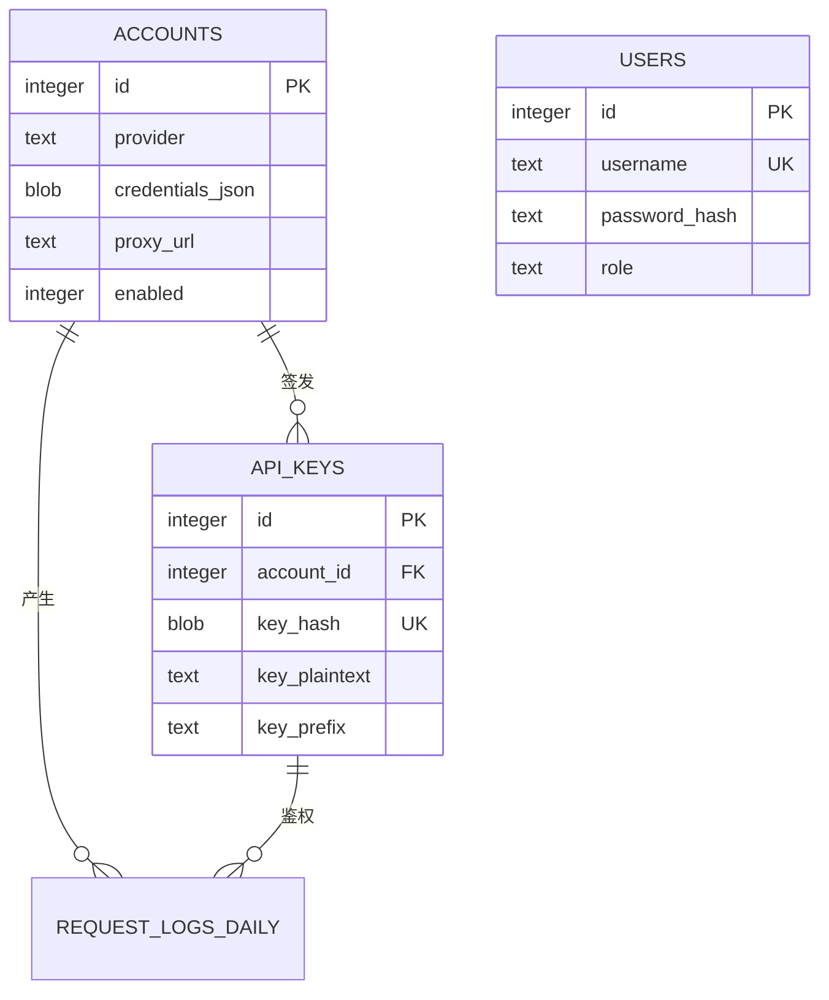

# 数据库设计与迁移说明

本文说明 `ai-unisub` 当前的 SQLite 数据库结构、初始化流程、历史迁移和运维约束。实现以 [`internal/database/database.go`](../internal/database/database.go) 为准；每日请求日志分表由 [`internal/repository/request_logs.go`](../internal/repository/request_logs.go) 管理。

若要增加每日用量、并发历史等统计能力，参见规划文档 [`docs/stats-database.md`](stats-database.md)（尚未落地实现）。

## 1. 总览

服务启动时通过 `database.Open` 打开数据库，并自动执行 `Migrate`：

1. 以 `0700` 权限创建数据库所在目录。
2. 打开 SQLite 数据库。
3. 将连接池限制为最多 1 个连接。
4. 验证数据库连接。
5. 创建基础表、索引并执行兼容迁移。

数据库默认路径由 `UNISUB_DB_PATH` 配置。当前设计面向单服务实例：不要让多个进程或容器同时直接写入同一个数据库文件。

启动时设置以下 SQLite 参数：

| 参数 | 值 | 作用 |
| --- | --- | --- |
| `journal_mode` | `WAL` | 改善读写并发；备份时不能只复制主 `.db` 文件 |
| `foreign_keys` | `ON` | 启用外键和级联删除 |
| `busy_timeout` | `5000` | 数据库锁冲突时最多等待 5 秒 |
| 最大连接数 | `1` | 避免 SQLite 多连接写入竞争，并确保连接级 PRAGMA 保持一致 |

## 2. 数据关系



核心关系如下：

- 一个账号可以签发多把 API Key，每把 API Key 只属于一个账号。
- 删除账号时，其 `api_keys` 会通过外键级联删除。
- 每日请求日志表不声明外键，以便按天独立创建和整表清理；账号或 Key 删除后，历史日志仍可保留。
- `admin` 是历史兼容表；当前登录用户保存在 `users` 表。

## 3. 固定表结构

### 3.1 `schema_migrations`

记录已经完成的迁移版本，保证迁移可重复执行。

| 字段 | 类型 | 说明 |
| --- | --- | --- |
| `version` | INTEGER | 主键，迁移版本号 |
| `applied_at` | TEXT | UTC RFC3339Nano 格式的执行时间 |

### 3.2 `accounts`

保存 Claude、Codex 和 Grok 上游账号及其运行状态。

| 字段 | 说明 |
| --- | --- |
| `id`、`name` | 账号 ID 和展示名称 |
| `provider` | `claude`、`codex` 或 `grok` |
| `auth_type` | `oauth` 或 `api_key` |
| `credentials_json` | 上游凭据 JSON，当前为明文存储 |
| `metadata_json` | Provider 扩展元数据，默认 `{}` |
| `proxy_url` | HTTP/SOCKS5 代理地址，当前为明文存储 |
| `status`、`enabled` | 业务状态和人工启停开关 |
| `concurrency_limit` | 账号最大并发数，默认 1 |
| `concurrency_queue_timeout_seconds` | 并发槽位等待秒数；0 表示继承服务配置 |
| `token_expires_at` | OAuth Token 失效时间 |
| `rate_limit_reset_at` | 上游限流重置时间 |
| `quota_json`、`quota_checked_at`、`quota_error` | 最近一次额度数据、检查时间和错误信息 |
| `last_used_at`、`last_error` | 最近使用时间和错误 |
| `created_by_user_id` | 创建该账号的管理端用户 ID；可空，历史账号为空 |
| `created_at`、`updated_at` | 创建和更新时间 |

### 3.3 `api_keys`

保存下游 `unisub_*` API Key。鉴权时计算请求 Key 的 SHA-256，并与 `key_hash` 比较。

| 字段 | 说明 |
| --- | --- |
| `id`、`account_id` | Key ID 和所属账号 ID |
| `name` | 展示名称 |
| `key_hash` | 完整 Key 的 SHA-256，唯一 |
| `key_plaintext` | 完整明文 Key，供详情查看和 CC Switch 导入 |
| `key_prefix` | 列表展示用前缀 |
| `enabled` | 是否启用 |
| `rpm_limit` | 每分钟请求上限；空值表示不单独限制 |
| `concurrency` | 预留的 Key 级并发字段 |
| `expires_at` | 可选失效时间 |
| `created_at` | 创建或最近重置时间 |

`account_id` 上有普通索引，但没有唯一约束，因此同一账号可以拥有多把 Key。

### 3.4 `users`

保存管理端登录用户。

| 字段 | 说明 |
| --- | --- |
| `username` | 唯一用户名 |
| `password_hash` | bcrypt 密码哈希，不保存明文密码 |
| `role` | `admin` 或 `user` |
| `enabled` | 是否允许登录 |
| `created_at`、`updated_at` | 创建和更新时间 |

### 3.5 `admin`

旧版单管理员表，仅用于兼容历史数据库和向 `users` 迁移。新功能不应继续依赖此表。

## 4. `request_logs_YYYYMMDD` 每日请求日志分表

请求日志按服务所在系统时区 `time.Local` 分表，表名为：

```text
request_logs_YYYYMMDD
```

关系图中的 `REQUEST_LOGS_DAILY` 是这组每日物理分表的逻辑名称，并不存在一张名为 `REQUEST_LOGS_DAILY` 的表。例如，2026 年 8 月 27 日的日志表为 `request_logs_20260827`。每张分表的完整结构如下：

| 字段 | SQLite 类型 | 约束/默认值 | 说明 |
| --- | --- | --- | --- |
| `id` | INTEGER | 主键，自增 | 当天分表内的日志 ID，不保证跨天唯一 |
| `account_id` | INTEGER | 可空 | 上游账号 ID；未声明外键 |
| `api_key_id` | INTEGER | 可空 | 下游 API Key ID；未声明外键 |
| `provider` | TEXT | 可空 | Provider，例如 `claude`、`codex` 或 `grok` |
| `method` | TEXT | 非空 | HTTP 请求方法 |
| `path` | TEXT | 非空 | 请求路径 |
| `query` | TEXT | 可空 | URL 查询参数，不包含开头的 `?` |
| `client_ip` | TEXT | 可空 | 来源 IP；优先取反向代理头（`X-Forwarded-For` / `X-Real-IP`），否则为直连地址 |
| `status_code` | INTEGER | 非空 | 返回给下游的 HTTP 状态码 |
| `started_at` | TEXT | 非空 | 请求开始时间 |
| `finished_at` | TEXT | 非空 | 请求结束时间 |
| `duration_ms` | INTEGER | 非空 | 请求总耗时，单位为毫秒 |
| `request_id` | TEXT | 可空 | 上游请求 ID 或链路请求 ID |
| `error_type` | TEXT | 可空 | 归一化后的错误类型 |
| `model` | TEXT | 可空 | 请求使用的模型 |
| `input_tokens` | INTEGER | 可空 | 输入 Token 数 |
| `output_tokens` | INTEGER | 可空 | 输出 Token 数 |
| `cache_read_tokens` | INTEGER | 可空 | 从缓存读取的 Token 数 |
| `cache_creation_tokens` | INTEGER | 可空 | 用于创建缓存的 Token 数 |
| `total_tokens` | INTEGER | 可空 | 总 Token 数 |
| `request_headers` | TEXT | 可空 | 脱敏后的完整请求头文本 |
| `request_body` | TEXT | 可空 | 请求正文；超过记录上限时截断 |
| `response_headers` | TEXT | 可空 | 脱敏后的完整响应头文本 |
| `response_body` | TEXT | 可空 | 响应正文；超过记录上限时截断 |
| `request_truncated` | INTEGER | 非空，默认 `0` | 请求正文是否被截断：`0` 否，`1` 是 |
| `response_truncated` | INTEGER | 非空，默认 `0` | 响应正文是否被截断：`0` 否，`1` 是 |

每张分表创建索引 `idx_request_logs_YYYYMMDD_account_started`，索引字段为 `(account_id, started_at DESC)`。

分表创建前会使用正则 `^request_logs_[0-9]{8}$` 校验表名，避免动态 SQL 表名注入。日志清理按保留天数删除整张过期分表，不逐行删除。

## 5. 迁移版本

迁移在每次启动时执行，已经完成的版本不会重复处理。

| 版本 | 内容 |
| --- | --- |
| 1 | 建立初始结构的版本标记 |
| 2 | 建立后续基础结构的版本标记 |
| 3 | 将 `concurrency_queue_timeout_ms` 迁移为 `concurrency_queue_timeout_seconds`；毫秒值向上取整，例如 2500 ms 变为 3 秒 |
| 4 | 将账号凭据、代理地址和 TOTP 字段从旧的“加密字段命名”迁移为当前明文字段命名，并删除 `credential_key_id` |
| 5 | 重建 `api_keys`，移除 `account_id` 的唯一约束，支持一个账号签发多把 Key |
| 6 | 当 `users` 为空时，将旧 `admin` 记录迁移为启用的管理员用户 |
| 7 | 删除已经由每日请求日志分表取代的旧 `usage_logs` 表 |
| 9 | 为 `accounts.created_by_user_id` 建立索引；非管理员只能查看自己创建账号下的调用记录 |

此外，启动时还会以幂等方式补齐：

- `accounts.concurrency_queue_timeout_seconds`；
- `accounts.credentials_json`；
- `accounts.proxy_url`；
- `accounts.created_by_user_id`；
- `api_keys.key_plaintext`；
- 每日请求日志后来新增的列（含 `client_ip`）。

注意：`api_keys.key_plaintext` 当前通过列存在性检查补齐，没有独立的 `schema_migrations` 版本记录。

## 6. 迁移实现约束

- 新增字段优先使用 `ensureColumn`，使新库和历史库都能安全启动。
- 字段重命名先检查新旧字段是否存在，避免重复执行。
- `api_keys` 的表重建在事务内完成，并在操作期间临时关闭外键检查。
- 迁移失败时 `Open` 会关闭数据库并中止服务启动，不允许带着不完整结构继续运行。
- 当前迁移不是“每个版本一个独立文件”的模式；修改时应同步更新 `Migrate`、迁移版本说明和兼容测试。

## 7. 安全与运维

### 敏感数据

以下内容以明文保存在 SQLite 中：

- `accounts.credentials_json`；
- `accounts.proxy_url`；
- `api_keys.key_plaintext`。

因此必须限制数据库文件、宿主机和备份文件的访问权限。管理端密码仅保存 bcrypt 哈希；API Key 鉴权仍使用哈希比对，但数据库中的明文副本同样需要按凭据保护。

### 备份

WAL 模式下不要在服务运行时只复制主 `.db` 文件。推荐使用 SQLite 在线备份：

```sh
sqlite3 /app/data/unisub.db ".timeout 5000" ".backup '/backup/unisub-YYYY-MM-DD-HHMMSS.db'"
sqlite3 /backup/unisub-YYYY-MM-DD-HHMMSS.db "PRAGMA integrity_check;"
```

恢复前应停止写入服务，保留原数据库文件，并先在副本上验证迁移和完整性。

## 8. 测试与变更检查

现有数据库测试覆盖：

- 毫秒并发等待值向秒迁移并向上取整；
- 凭据和代理历史字段重命名及旧字段清理；
- 已完成迁移不会覆盖用户后来设置的值；
- 移除 API Key 的账号唯一约束后，同一账号可插入多把 Key。

数据库结构变更后至少执行：

```sh
go test ./internal/database ./internal/repository
go test ./...
```

新增迁移时，建议同时验证全新数据库、目标历史版本数据库、重复执行迁移和迁移失败后的数据完整性。
