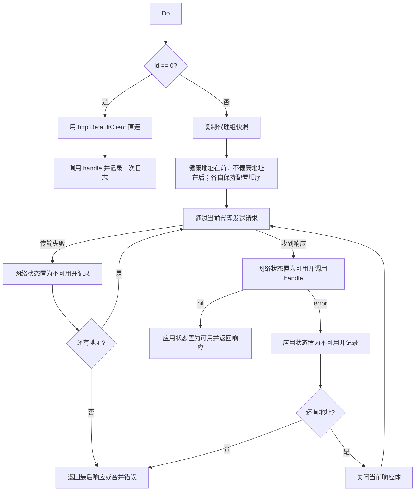

# Proxy 包设计

`internal/proxy` 管理代理组、执行直连或代理 HTTP 请求、维护组内健康状态，并把代理组状态和每次出站尝试写入数据库。本文只描述当前实现，不把尚未存在的探测、熔断或策略配置写成已有能力。

## 职责与边界

Proxy 包负责：

- 校验和管理有序代理组；
- 根据最近一次网络／应用结果调整代理尝试顺序；
- 为每次尝试重建请求体并配置独立的代理 Transport；
- 在代理失败或调用方判定响应不可接受时尝试组内下一个地址；
- 保存代理组配置、健康状态和逐次调用日志；
- 提供并发安全的生命周期、列表、增删改和请求执行接口。

Proxy 包不负责：

- Web 权限、请求参数和 HTTP 管理响应；这些属于 `internal/unisub`；
- OAuth 协议、AI 请求转换或供应商状态码含义；这些由调用包通过回调分类；
- 主动探测、定时健康检查、熔断、冷却、半开、失败率窗口或最大重试次数；
- 代理日志查询和清理接口；这些能力当前只在 `database.Database` 中；
- 跨代理组共享健康状态。同一 URL 出现在不同组时，每个组分别保存状态。

当前 Proxy 直接依赖 `database.Database`，而不是自定义 Store 接口。Service 创建并打开 Manager，再将 `ProxyManager` 注入 OAuth、AIProvider 和应用模块。日志统一通过 `internal/logger` 输出。

## 文件结构

```text
internal/proxy/
  types.go         代理组、状态和 ProxyManager 接口
  manager.go       生命周期、配置管理、调度、HTTP 请求和持久化
  errors.go        包级错误
  logger.go        ModuleLogger 声明
  manager_test.go  当前行为测试
```

包内没有独立的 Endpoint、Policy、Scheduler、Prober 或 HealthStore 类型。

## 领域模型

### 代理组配置

```go
type ProxyGroupConfig struct {
    Name    string   `json:"name"`
    Proxies []string `json:"proxies"`
}
```

- `Name` 去除首尾空白后必须非空。
- `Proxies` 至少包含一个地址，数组顺序表示静态优先级。
- 同一规范化地址不能在一个组内重复，但可以出现在不同组中。
- 当前没有 enabled、max_retries、探测地址或健康策略字段。

### 健康状态

```go
type ProxyGroupState struct {
    Proxies map[string]ProxyState `json:"proxies,omitempty"`
}

type ProxyState struct {
    Healthy      bool                             `json:"healthy"`
    LastSuccess  time.Time                        `json:"last_success,omitzero"`
    LastFailure  time.Time                        `json:"last_failure,omitzero"`
    Applications map[string]ProxyApplicationState `json:"applications,omitempty"`
}

type ProxyApplicationState struct {
    Healthy     bool      `json:"healthy"`
    LastSuccess time.Time `json:"last_success,omitzero"`
    LastFailure time.Time `json:"last_failure,omitzero"`
}
```

状态键和作用域如下：

| 状态 | 键 | 更新条件 |
| --- | --- | --- |
| 网络状态 | 组 ID + 代理 URL | HTTP 传输失败记为不可用；收到任何 HTTP 响应记为可用 |
| 应用状态 | 组 ID + 代理 URL + app | 分类回调返回错误记为不可用；回调为空或返回 nil 记为可用 |

没有状态记录的代理视为可用。网络状态不可用时，该地址对所有 app 都排在健康地址之后；网络可用但指定 app 不可用时，只影响该 app。状态表示最近一次已分类结果，不包含计数、失败率、冷却时间或半开配额。

健康状态属于 `ProxyGroup`。同一地址被多个组引用时不会共享状态；重启后从各组的 `state` JSON 恢复。

### 代理组

```go
type ProxyGroup struct {
    ID     int              `json:"id"`
    Config ProxyGroupConfig `json:"config"`
    State  ProxyGroupState  `json:"state"`
}
```

内部还有不参与 JSON 输出的 dirty 标记，用于延迟保存健康状态。`List` 返回按 ID 升序排列的深拷贝，调用方修改返回值不会改变 Manager 内部状态。

## 地址校验与规范化

创建和更新代理组时，Manager 对每个地址执行以下处理：

1. 去除首尾空白并使用 `url.Parse` 解析；
2. 要求 Host 和 Hostname 非空；
3. 将 Scheme 转为小写，只接受 `http`、`https`、`socks5`、`socks5h`；
4. 拒绝 Query 和 Fragment；
5. 将仅为 `/` 的 Path 归一化为空；
6. 按规范化后的完整字符串检查组内重复。

当前后端没有进一步限制普通 Path，也没有单独执行连通性、凭据或代理协议握手测试。构造成功只表示 URL 通过上述结构校验。

代理 URL 可以包含 userinfo。当前配置响应、`proxy_groups.config` 和代理调用日志都可能保存完整 URL，因此可能包含代理用户名或密码；这些数据应按敏感配置保护。结构化运行日志的请求失败事件当前不输出代理 URL。

## ProxyManager 接口

```go
type ProxyManager interface {
    Open() error
    Close() error
    List() []ProxyGroup
    Create(config ProxyGroupConfig) (id int, err error)
    Delete(id int) error
    Update(id int, config ProxyGroupConfig) error
    Do(id int, app string, req *http.Request, body []byte,
        handle func(res *http.Response) error) (*http.Response, error)
}
```

### 生命周期

| 阶段 | 行为 |
| --- | --- |
| 构造 | `NewManager(db)` 保存数据库依赖，尚不能执行 CRUD 或请求 |
| 打开 | `Open` 读取全部 `PersistedProxyGroup`，解码配置和状态，启动每分钟一次的 dirty 状态刷新任务 |
| 运行 | CRUD 与 `Do` 可并发调用；组和状态由同一读写锁保护 |
| 关闭 | `Close` 停止刷新任务，拒绝新请求，等待已经登记的 `Do` 完成，再执行一次 dirty 状态刷新 |

同一实例在打开期间重复 `Open` 返回 nil；关闭后不能重新打开。未打开时 CRUD／`Do` 返回 `ErrManagerNotOpen`，关闭后返回 `ErrManagerClosed`。`Close` 在未打开或已经关闭时返回 nil。

第一次 `Close` 的最终刷新失败会返回错误，但 Manager 此时已经关闭；后续重复 `Close` 不会再次刷新。Service 的关闭顺序是 AIProvider → Proxy → Database。

### 配置管理

| 方法 | 当前行为 |
| --- | --- |
| `List` | 返回全部组的深拷贝，按 ID 升序排列；不要求 Manager 已打开 |
| `Create` | 校验配置，创建空状态，先写数据库并取得正数 ID，再加入内存 |
| `Update` | 全量替换配置；保留仍在新配置中的地址状态，删除已移除地址的状态，新地址从未知状态开始 |
| `Delete` | 先删除数据库记录，再删除内存组；历史代理日志不级联删除 |

Create、Update 和 Delete 同步写数据库，失败时不提交内存变更。健康状态更新只标记 dirty，由后台任务或 Close 刷新。

## 请求执行与重试

`Do` 是当前唯一的出站执行入口。`id == 0` 表示直连；正数表示使用指定代理组。请求 Context 继续负责取消和截止时间，代理配置不放入 Context。



### 候选顺序

Manager 不会排除不健康地址。它先按配置顺序排列“网络健康且当前 app 健康”的地址，再按配置顺序附加其余地址。因此：

- 健康状态只是排序依据，不是熔断开关；
- 一次调用最多尝试组内每个地址一次；
- 如果前面的健康地址成功，排在后面的不健康地址不会在该次调用中获得恢复机会；
- 如果所有地址都标记为不健康，它们仍会按原配置顺序被尝试；
- 正常创建的组至少有一个地址，所以 `ErrNoAvailableProxy` 主要用于空的旧数据或异常状态。

### 请求体与所有权

`body` 是每次尝试的唯一请求体来源。Manager 忽略原始 `req.Body`，为每次直连或代理尝试克隆 request，并用 `body` 设置新的 Body、ContentLength 和 GetBody；传入切片不会被复制。调用方必须在 `Do` 返回前保持该切片不变。

收到最终响应时，响应体由调用方关闭。需要继续尝试下一个地址时，Manager 会先关闭当前响应体。每个代理尝试都会从 `http.DefaultTransport` 克隆一个 Transport，设置 `http.ProxyURL`，并在响应体关闭后关闭该 Transport 的空闲连接；当前不跨请求复用代理连接池。直连使用 `http.DefaultClient`。

### 响应分类回调

Proxy 不解释 HTTP 状态码。`handle` 的返回值定义应用层结果：

- `handle == nil` 或返回 nil：响应可接受，应用状态标为可用；
- 返回 error：响应被当前应用拒绝，应用状态标为不可用，并在还有候选时继续重试。

最后一个代理返回被拒绝的响应时，`Do` 同时返回该 response 和合并后的 error；调用方必须明确决定使用响应还是错误。如果后续代理成功，先前尝试的错误不再返回，但每次尝试仍各自记录到数据库。

Proxy 不判断方法是否幂等，也不判断请求是否可能已经到达上游。是否传入 `handle`、哪些状态允许切换代理，以及是否适合重放，由调用方负责。

### 直连语义

`id == 0` 时不读取代理组，也不更新健康状态，但仍执行分类回调并写入一条 `group_id = 0`、`proxy_url = ""` 的代理调用日志。直连传输失败、分类失败或日志写入失败都会通过返回错误报告。

## 调用方集成

### AIProvider

AIProvider 使用供应商 ID 作为 `app`。只有被判断为可安全重放的请求才传入响应分类回调；该回调把 429 和 5xx 视为当前代理的应用失败。其他请求不按 HTTP 状态切换代理，但传输失败仍会尝试下一个地址。

当 `Do` 返回非 nil response 时，AIProvider 使用该最终响应，即使同时存在分类 error；没有响应时才向上返回请求错误。

### OAuth

OAuth 使用 `oauth:<service>` 作为 `app`，并通过自定义 RoundTripper 调用 `Do`。OAuth 将 5xx 响应分类为应用失败，HTTP Client 总超时为 30 秒。授权 Session 保存的 HTTP Client 只持有代理组 ID，每次请求仍从 Manager 读取该组，不绑定某个代理地址，也不在 Context 中保存代理 URL。

未指定代理组时，OAuth 同样通过 `Do(0, ...)` 直连并记录调用。撤销流程如果接收调用方提供的 HTTP Client，则通过 `recordingTransport` 记录请求，但不经过代理组调度。

## 状态与日志持久化

### 代理组

Proxy 将领域对象转换为：

```go
type PersistedProxyGroup struct {
    ID     int
    Config json.RawMessage
    State  json.RawMessage
    // database 层还保存 CreatedAt、UpdatedAt
}
```

`config` 保存名称和有序 URL，`state` 保存组内网络／应用健康状态。Open 只解码已存 JSON，不重新执行 Create／Update 的语义校验；无效 JSON 会使 Open 失败。

健康变化首先写入内存并标记 dirty。后台每分钟保存 dirty 组；保存失败时保留 dirty 标记，并在下一轮继续尝试。正常情况下落库延迟约一分钟；数据库持续失败或进程异常退出时，可能丢失所有尚未成功刷新的健康变化。

### 逐次调用日志

每次实际直连或代理尝试调用 `database.RecordProxyLog`：

| 字段 | 含义 |
| --- | --- |
| `group_id` | 使用的代理组；直连为 0 |
| `proxy_url` | 本次代理 URL；直连为空 |
| `url` | 目标请求的完整 URL |
| `app_type` | 调用方传入的 app |
| `http_error_code` | 收到响应时的 HTTP 状态；传输失败为 0 |
| `http_error_message` | 传输错误或分类回调错误；成功为空 |
| `time` | 尝试发生时间 |

代理日志不是聚合统计。SQLite 按 UTC 日期写入 `proxy_logs_YYYYMMDD`，PostgreSQL 写入按日分区的 `proxy_logs`；查询、分页和清理由 Database 提供，详见 [Database](database.md)。当前 ProxyManager 和管理 HTTP API 不公开代理日志查询。

目标 URL、代理 URL 和错误文本按原值写入数据库，没有字段级脱敏。调用方不得把访问令牌放入 URL，数据库及备份也必须按敏感数据保护。

## 管理 API

管理路由由 `internal/unisub` 实现，全部要求管理员 Session：

| 方法 | 路径 | 行为 |
| --- | --- | --- |
| GET | `/api/proxy-groups` | 返回全部代理组；空结果固定为 `[]` |
| POST | `/api/proxy-groups` | 创建代理组，成功返回 201 和新组 |
| GET | `/api/proxy-groups/{id}` | 返回指定组，不存在时 404 |
| PUT | `/api/proxy-groups/{id}` | 全量替换组配置并返回更新后的组 |
| DELETE | `/api/proxy-groups/{id}` | 删除组，成功返回 204 |

当前没有 `/test` 主动探测端点，也没有通过管理 API 查询代理错误或历史日志的端点。管理响应直接包含 `config` 和 `state`，Dashboard 据此显示组内最近健康结果和调整 URL 顺序。

## 错误与日志

可供调用方使用 `errors.Is` 判断的导出错误：

| 错误 | 条件 |
| --- | --- |
| `ErrProxyGroupNotFound` | 指定组不存在，或删除 ID 非正数 |
| `ErrNoAvailableProxy` | 组没有任何可尝试地址 |
| `ErrManagerNotOpen` | Manager 尚未打开 |
| `ErrManagerClosed` | Manager 已关闭 |

配置、依赖和请求参数错误是包内 error，统一声明在 `errors.go`。

`logger.go` 声明 `ModuleLogger = logger.ModuleLogger("proxy")`。当前主要事件包括：

- 生命周期：`opened`、`open_failed`、`closed`、`close_failed`、`state_flush_failed`；
- 配置：`group_created`、`group_updated`、`group_deleted`；
- 请求：`request_failed`、`response_rejected`、`proxy_attempt_failed`、`proxy_response_rejected`、`no_available_proxy`；
- 持久化：`record_call_failed`。

请求事件记录 group_id、app 和必要的 HTTP status；当前不会在结构化运行日志中记录代理 URL、目标 URL、响应正文或认证头。逐次请求的详细 URL 和错误归档属于数据库代理日志。

## 并发与一致性

- 代理组 map、状态和 dirty 标记由 Manager 的读写锁保护。
- `Do` 在开始时复制组配置与状态快照，后续配置修改不会改变本次候选列表。
- 活跃请求由 WaitGroup 统计；Close 在数据库仍可用时等待它们完成。
- 状态以请求完成顺序更新；并发请求的最后写入结果成为当前健康值。
- Manager 只在 Open 时加载代理组，没有跨进程或外部数据库修改的自动刷新机制。
- 删除组不会删除历史代理日志，也不会检查账号或 OAuth Session 是否仍引用该组；引用完整性由应用层负责。

## 当前限制

- 健康状态只改变排序，不阻止请求；没有熔断、冷却或自动恢复任务。
- 没有代理级连接池复用，每次代理尝试都创建并回收一个 Transport。
- 没有组级启用开关、重试上限、权重、随机或轮询策略。
- 同一代理地址跨组不共享健康状态或历史决策。
- 配置和代理日志可能保存带 userinfo 的完整代理 URL；当前没有凭据脱敏或加密。
- 健康状态正常情况下约一分钟内落库；写库失败会继续延迟，异常退出不保证零丢失。
- Manager 不提供历史日志查询；管理页面只能看到当前组状态。
- 当前自动化测试使用本地 HTTP Server 作为代理模拟，不等同于真实 HTTP CONNECT、HTTPS 或 SOCKS 代理验证。

## 验证范围

`internal/proxy/manager_test.go` 当前覆盖：

- 分类失败后按顺序重试、显式请求体复用和最终响应返回；
- 健康结果改变后续候选顺序，并通过定时刷新在重载后恢复；
- 每次尝试写入代理日志，HTTP 状态本身不被 Manager 自动解释；
- `id == 0` 的直连、显式 body 和调用日志；
- 代理组 Create／Update／List／Delete，以及 List 深拷贝边界。

数据库分区、查询和清理测试属于 `internal/database`；OAuth 与 AIProvider 的分类和调用集成由各自包测试维护。
